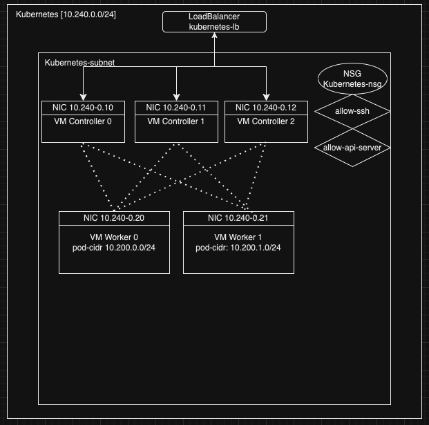

# Kubernetes the hard way in Azure
###### Jagan Lakshmipathy 
###### 12/21/2024

### 1. Introduction
In this repo we will work through the details on how to stand up and deploy Kuberenetes cluster the hard way in Azure. We mean the hard way to refer to a self managed cluster as opposed to managed clusters offered by major cloud providers like Azure, DigitalOcean, GCP and AWS. This repo was inspired by this [tutorial](https://github.com/ivanfioravanti/kubernetes-the-hard-way-on-azure/blob/master/README.md), which in turn is a fork of the [Kubernetes The Hard Way](https://github.com/kelseyhightower/kubernetes-the-hard-way) tutorial by [Kelsey Hightower](https://x.com/i/flow/login?redirect_after_login=%2Fkelseyhightower). 

### 2. Step-by-step Approach to the Self-managed Kubernetes Cluster
This repo contains 23 shell scripts which we will use in different parts of this deployment. This deployment will leverage the Azure and we will deploy 3 controller nodes to deploy kubernetes control plane components and 2 worker nodes run workloads and to deploy kublet components. However, this can be extended to any number of controllers and workers. Our scripts will be run either in a controller node, or a worker node or your local host where you run kubectl client to control the kubernetes from. Before we get started, let's login to your azure account from your local host. Of the 23 shell scripts, two of them are scripts that will help the user to remote copy and login to the Azure nodes. In our case, we will use it to copy files from local host to controller nodes or worker nodes. 
```
    remote-login controller-0  #this will command will let you login to controller-0 node in the Azure cluster
    remote-copy controller-0 a.txt  # this command will remote copy the local file a.txt to the controller-o node in the Azure cluster

```
#### 2.1 Create Compute Resources
At this step, we will create a azure cluster as shown in this diagram below by running the 01-compute-resources.sh. We need to be aware of 3 CIDR ranges: (1) Azure VNET 10.240.0.0/24, (2) Kubernetes Cluster IP 10.32.0.0/24, and (3) POD CIDR 10.200.0.0/16. Two of the 3 CIDR ranges listed above, (1) and (3) are shown in the diagram below. They refer to the VNET and POD CIDR ranges. The (2) CIDR range is not shown in the diagram below but they are listed in the 02-certificate-authority.sh, 06-bootstrapping-cp.sh, and 07-bootstrapping-kubelet.sh. We will walk through them detail as we run those scripts. Script in 01-compute-resources.sh will create the network shown in the diagram below. We will run in this in our local host. As we are running this list in MacOS and zsh.




#### 2.2 Create Certificates
At this step, we will run 02-certificate-authority.sh. This script will create admin, ca kubeernetes, service-account, kube-controller-manager, kube-scheduler, worker-0, and worker-1 certificates. In the end, we will copy ca.pem, kubernetes.pem, kubernetes-key.pem, worker-0.pem, and worker-1.pem to the worker nodes. We will copy ca.pem, kubernetes.pem, kubernetes-key.pem, and service-account.pem to the controller nodes. It is worth noting the difference between the ivan's repo and this repo is that kubernetes hostname parameter includes the worker node ips at line 243 when generating the kubernetes pem certificates. In this repo, we are planning to use the Calico CNI. Calico need to connect to ETCD nodes in control plane. 

#### 2.3 Create Kubenernetes Configurations for Internal Connections
At this step, we will run 03-kube-configurations.sh. This script we will generate 6 *.kubeconfig files. These files are used to connect to internal kubernetes components to connect to eeach other. As the name of the files suggest, they enable that specific component. Example, kube-proxy.kubeconfig, file enable connecting to kube-proxy component using kubectl. Similarly, admin.kubeconfig enable you to connect to the Kubernetes API server as a admin user.

#### 2.4 Create Encryption Configurations
At this step we will run the 04-encryption-configuration.sh. This script will create an encryption configuration file and upload this to controller hosts. This encryption file will used when deploying the kube-apiserver. This will help to keep the file or any data at rest encrypted. 

#### 2.5 Bootstrap ETCDs
In this step, we will remote copy the 05-bootstrapping-etcd.sh to each controller nodes (in our case 3 controllers). And then we remote login to each controller node to run this script from that node. It is imperitive to start them simulataneously as much as possible in all the nodes. As each instance of ETCD will look for its counterpart in the other controllers. Make sure to change file mode to executable using the 'chmod' command. At the end of the script, you will see "Verified etcd instance" on the console, that verifies each instance had verified the other two instance running on the controllers.

To verify etcd cluster health, run the following command. This will show 3 instances of etcd in the list.
```
    ETCDCTL_API=3 etcdctl --cacert=/etc/etcd/ca.pem \
      --cert=/etc/etcd/kubernetes.pem --key=/etc/etcd/kubernetes-key.pem \
      --endpoints=https://10.240.0.10:2379,https://10.240.0.11:2379,https://10.240.0.12:2379 \
      member list
```

Run this command on controller-0, to verify ping works.
```
    nc -zv 10.240.0.11 2380
    nc -zv 10.240.0.12 2380
```
If you see any failures, ensure the NSG (Network Security Group) allows: (a) TCP 2379 (client API), (b) TCP 2380 (peer communication), and (c) Internal communication between controller nodes.
```
    sudo iptables -L -n -v | grep 2380
```
If needed, open ports:
```
    sudo iptables -A INPUT -p tcp --dport 2380 -j ACCEPT
    sudo iptables -A INPUT -p tcp --dport 2379 -j ACCEPT
```
On each controller node, run the following command to see if there are any network errors, or mismatched cluster states.
```
    sudo journalctl -u etcd -f --no-pager
```

#### 2.6 Bootstrap Control Plane
At this step, first we will copy 06-bootstrapping-cp.sh, and 06-setup-kubernetes-authorization.sh to each controller nodes. Note the --service-cluster-ip-range flags at line 74 and 107. They have to match and they refer to the clusterIP service range. Also, note the kube controller manager options cluster-cidr=10.200.0.0/16 --allocate-node-cidrs=true. They together enable CIDR range for the POD virtual device that are created. At the end the bootstrapping script will list the running components that will list 3 etcd components one each on the controller and scheduler and controller-manager components.The authorization setup script will create a clusterRole and roleBinding for kubernetes users. So, run  06-bootstrapping-cp.sh, and 06-setup-kubernetes-authorization.sh in that order in each controller. 

Now, run 06-setup-frontend-lb.sh and 06-verify-controller.sh locally in that order. The frontend-lb script will create the LB and verify script will mruncurl command with a sample payload to verify the kubernetes version. 

Run the 08-configure-kubectl.sh locally. This will generate the kubernetes-the-hard-way.kubeconfig. From now on you will use this kubeconfig to connct to the cluster. Run the following commands locally to create the cluster roles and rolebindings for worker nodes to access.
```
    kubectl apply -f node-cluster-roleb.yaml --kubeconfig=kubernetes-the-hard-way.kubeconfig
    kubectl apply -f node-cluster-rolebinding.yaml --kubeconfig=kubernetes-the-hard-way.kubeconfig
```
#### 2.7 Bootstrap Kubelet Components
Now that, we have setup the Control Plane, lets setup the Worker Nodes. Bootstrapping kubelet is the central piece in the worker node setup. Note, we added kubernetes.pem and kubernetes-key.pem files to /usr/lib/kubernetes directory at line 124 of 07-bootstrapping-kubelet.sh. We will use these files when configuring the calico (see the generated 10-calico.conf referring to the kuberenetes*.pem files). 

So, first run the 07-get-calico-resources.sh. This will generate the 10-calico.conf, download calico binaries and copy these files to each worker nodes. 

Secondly, remote copy and run the 07-bootstrapping-kubelet.sh in each worker nodes and copy 07-verify-workers-from-controller.sh to controller-0. And then finally, run the 07-verify-workers-from-controller.sh to verify the kubernetes setup. We get the nodes using kubectl from the controller to see all the worker nodes.


#### 2.8 Setup Kubectl to remote to your Kubernetes Cluster
Run the 08-verify-kubectl.sh locally to verify the set up by listing the component statuses and nodes. This script runs these commands:
```
    kubectl get componentstatuses --kubeconfig=kubernetes-the-hard-way.kubeconfig
    kubectl get nodes --kubeconfig=kubernetes-the-hard-way.kubeconfig
```
Run the following commands to verify ETCD, and API servers accessible from worker nodes
```
    curl --key /var/lib/kubernetes/kubernetes-key.pem  --cert /var/lib/kubernetes/kubernetes.pem --cacert /var/lib/kubernetes/ca.pem     https://10.240.0.11:2379/health
    curl --key /var/lib/kubernetes/kubernetes-key.pem  --cert /var/lib/kubernetes/kubernetes.pem --cacert /var/lib/kubernetes/ca.pem     https://10.240.0.11:6443/healthz
```
To verify kublet API from the worker nodes. 
```
    curl -s --cacert /var/lib/kubernetes/ca.pem     --cert /var/lib/kubelet/worker-1.pem     --key /var/lib/kubelet/worker-1-key.pem     https://10.240.0.21:10250/healthz
```
Finally, check the network connectivity to API servers using the following:
```
    nc -zv 10.240.0.12  6443
    telnet 10.240.0.12  6443 --cert /var/lib/kubernetes/ca.pem https://127.0.0.1:10250/healthz
```
#### 2.9 Running Calico
 Ensure Calico binaries are in the /opt/cni/bin directory. The Calico binaries are calico and calico-ipam. Make sure that the calico and calico-ipam binaries are executable. Confirm that the etcd instance is accessible from the nodes where Calico is running. You can do this by testing the connection to the etcd endpoints you’ve provided in your 10-calico.yaml. The following is the command:
```
    curl --key /var/lib/kubernetes/kubernetes-key.pem  --cert /var/lib/kubernetes/kubernetes.pem --cacert /var/lib/kubernetes/ca.pem     https://10.240.0.11:2379/health
```
Ensure the CNI configuration file (10-calico.conf) is correctly placed in /etc/cni/net.d/. Confirm 10-calico.yaml iscorrect with the following essential configurations: (1) CNI Type: calico, (2) IPAM: Ensure it’s set to use calico-ipam, (3) ETCD Endpoints and Certificates: You need to explicitly set the endpoints and certificates for the calico CNI to connect to your etcd store. Example of a valid CNI configuration (/etc/cni/net.d/10-calico.conf): The paths to the certificates (kubernetes-key.pem, kubernetes.pem, and ca.pem) are correct for your Kubernetes setup.

At the time of Pod Creation, Kublet invokes the Calico CNI Plugin, sets up nework by allocating IP for the POD, sets up veth pairs, and configures routes. Enforces policy as configured in the kubernetes network policy and applies the iptables. Uses a datastore (e.g., etcd) to store the network state. Pod traffic is effected using (e.g., BGP, OR IP-in-IP). So, to get calico running, we need to configure the calico node (DaemonSet) and calico kube-controller (Deployment).

Finally, run the following command to run the calico.
```
    kubectl apply -f calico-sa-role-binding-config.yaml  --kubeconfig=kubernetes-the-hard-way.kubeconfig
    kubectl apply -f calico-node-daemonset.yaml  --kubeconfig=kubernetes-the-hard-way.kubeconfig
    kubectl apply -f calico-kube-controllers.yaml  --kubeconfig=kubernetes-the-hard-way.kubeconfig
```
#### 2.10 Create Kubernetes Configurations for Kuberenetes API

#### 2.11 Create Kubernetes Configurations for Kuberenetes API
#### 2.12 Verify Nodes & Components
#### 2.13 Create Pod Routes
#### 2.14 Deploy & Verify CoreDNS


# az-kube-the-hardway-calico


First lets figure out all the versions:
1. ETCD : https://github.com/etcd-io/etcd/releases/tag/v3.5.12
2. Calico 3.29
3. Kubernetes v1.29 (https://www.downloadkubernetes.com/)

https://dl.k8s.io/v1.29.12/kubernetes-client-linux-amd64.tar.gz
 https://dl.k8s.io/v1.29.12/kubernetes-server-linux-amd64.tar.gz
 https://dl.k8s.io/v1.29.12/kubernetes-node-linux-amd64.tar.gz


VERSION="3.5.12"
"https://github.com/etcd-io/etcd/releases/download/v$VERSION/etcd-v$VERSION-linux-amd64.tar.gz"

VERSION="1.29.0"
wget -q --show-progress --https-only --timestamping \
  https://github.com/kubernetes-sigs/cri-tools/releases/download/v$VERSION/crictl-v$VERSION-linux-amd64.tar.gz

VERSION="latest"
wget https://storage.googleapis.com/gvisor/releases/release/$VERSION/runsc
chmod +x runsc
mv runsc /usr/local/bin/

VERSION="1.1.9"
wget -q --show-progress --https-only --timestamping \
  https://github.com/opencontainers/runc/releases/download/$VERSION/runc.amd64
install -m 755 runc.amd64 /usr/local/sbin/runc

VERSION="1.3.0"
wget -q --show-progress --https-only --timestamping \
  https://github.com/containernetworking/plugins/releases/download/v1.2.0/cni-plugins-linux-amd64-v1.2.0.tgz \

VERSION="1.7.5"
wget https://github.com/containerd/containerd/releases/download/v$VERSION/containerd-$VERSION-linux-amd64.tar.gz
tar -xvf containerd-$VERSION-linux-amd64.tar.gz -C /usr/local

